# Zeitmessung Grossanzeige

Selbstgebaute Grossanzeige für ALGE Zeitmessungen. 
Die Grossanzeige kann über RS-232 mit den folgenden ALGE Zeitmessungen betrieben werden:
* ALGE OPTIc3 
* ALGE OPTIc 
* ALGE Timer VT2
* ALGE Timer S3 

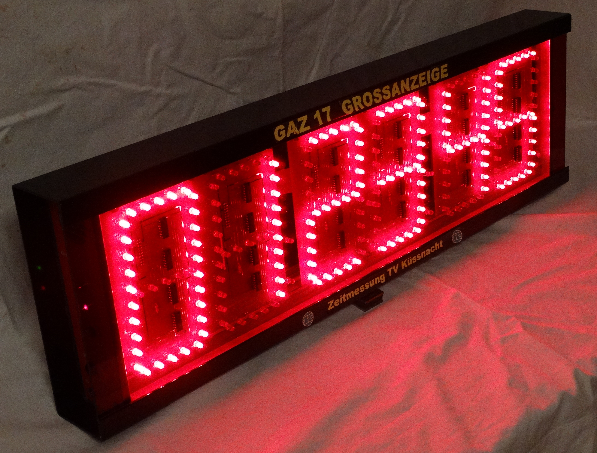

## Hardware Aufbau

Die GAZ hat auf beiden Seiten einen 12 V Anschluss für die Stromversorgung. Sowie zwei Bananenbuchsen für die Einspeisung des RS-232 Signals von der Zeitmessung. Ausserdem zwei Überwachungs-LED für die 12V und 5V Speisung.

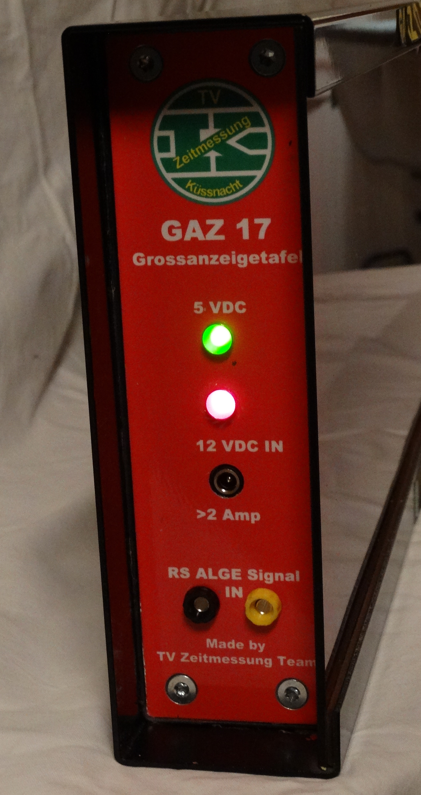
  
Die GAZ ist modular aufgebaut. Sie besteht aus:
* Eine Steuer-Leiterplatte, welche die Stromversorgung, die Ansteuerung der 7-Segment Digits, sowie den Microcontroller enthält.
* Sechs Digit-Leiterplatten, die jeweils ein 7-Segment Digit enthalten.
* Ein 20 poliges Flachbandkabel, welche die Steuer-Leiterplatten mit den Digit-Leiterplatten verbindet.
* Zwei Seitenwände, welche den Stromanschluss sowie die Anschlüsse für das RS-232 Signal enthalten.
* Eine Frontscheibe aus Plexiglas.
* Ein Gehäuse, welches die anderen Komponenten aufnimmt und vor Umweldeinflüssen schützt.

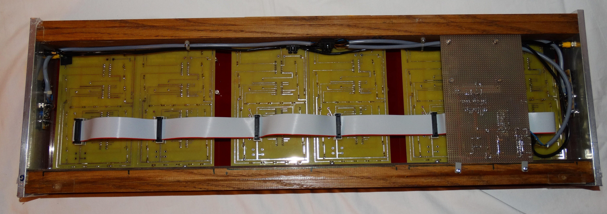

### Steuer-Leiterplatten
  
Die Steuer-Leiterplatten besteht aus einem Laborprint auf welchem ein Raspberry PI 2 Model B aufgeschraubt ist. Das Raspberry PI liest das RS-232 Signal über den PIN 10 (UART0 RXD) ein. Damit das RS-232 Signal vom Raspberry gelesen werden kann wird es zuerst durch eine Pegelanpassungsschaltung Schaltung auf der Steuer-Leiterplatte von +/- 24V auf 0 und 5V umgewandelt. Das Raspberry steuert die Anzeige über den 7-Segment Steuer-Baustein MAX 7219 an. Die Kommunikation zwischen Raspberry und MAX 7219 findet über die SPI Schnittstelle statt: Pin 19 (SPI0 MOSI), Pin 21 (SPI0 CLK) und Pin 24 (SPI0 CE0). Ausserdem befindet sich auf der Steuer-Leiterplatte der DC/DC Wandler TEM 3-1211N. Er wandelt die externe Speisungsspannung von 12V auf 5V um. Diese wird für das Raspberry PI und die TTL Logik Bausteine auf den Digit-Leiterplatten gebraucht.

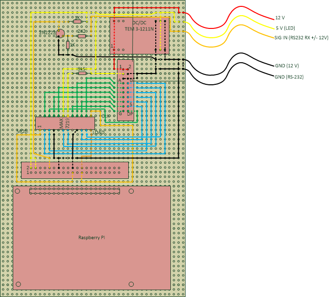

### Digit-Leiterplatte

Jedes einzelne Digit sitzt auf einer eigenen Leiterplatte. Alle Digit-Leiterplatten sind identisch aufgebaut. Jedes Digit ist aus 7 Segmenten und dem Dezimalpunkt aufgebaut. Ein Segment besteht aus 5 LED vom Typ XYZ. der Dezimalpunkt besteht aus 2 LED.

Die einzelnen LED eines Segments sind in Serie geschaltet und direkt mit der 12 V Speisungsspannung verbunden. Jedes Segment wird über einen Inverter Buffer mit Open Kollektor Baustein (SN74LS06) angesteuert. Ist der Ausgang hochohmig so ist das Segment ausgeschaltet. Wird das Ausgang auf Ground gezogen so ist das Segment eingeschaltet. Ein AND Baustein verknüpft die Digit- und Segment-Steuersignale vom 7 Segment Steuer-Baustein miteinander. Die Digitposition wird mittels Lötbrücke auf der Leiterplatte konfiguriert. 

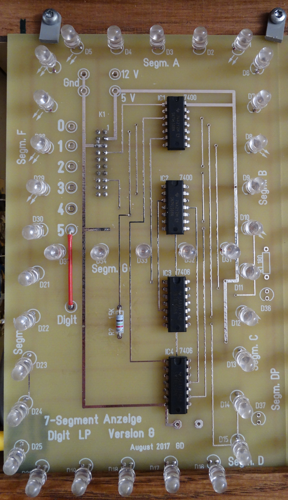

Die Digit-Leiterplatte wurden mit der Software Target 3001 entworfen und gelayoutet. Sie wurden von einem professionellen Anbieter hergestellt.  

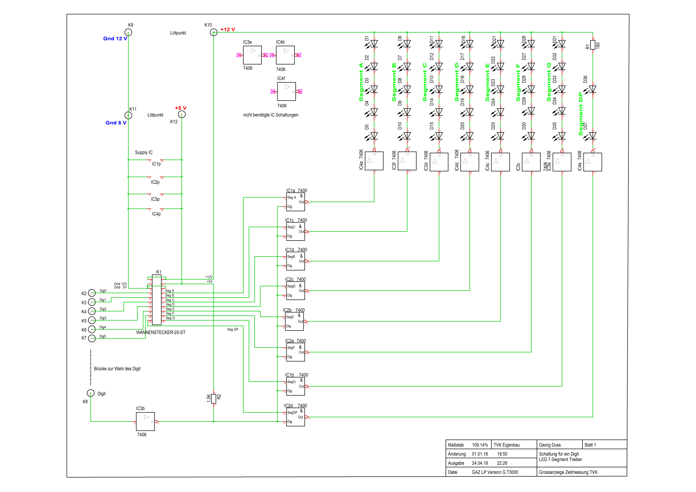
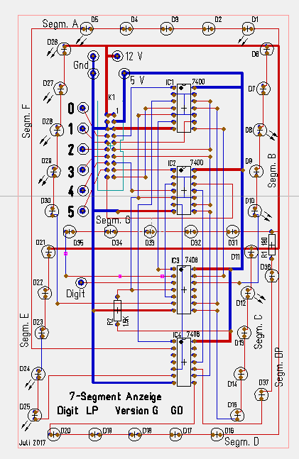

   

### Gehäuse

Das Gehäuse besteht aus einem Leiterplattenträger aus Holz. Auf diesem werden die Digit-Leiterplatten vorne und die Steuer-Leiterplatten hinten montiert.

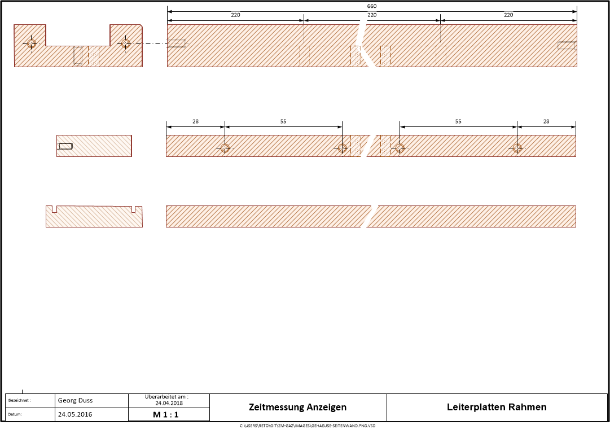 

Seitlich werden die Seitenwände, welche aus Aluminium hergestellt sind montiert.

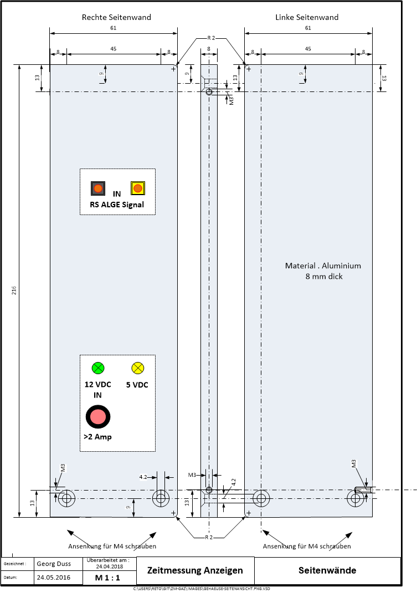

Die Aussenwand, in welche man den Leiterplattenträger inklusive Leiterplatten und Seitenwände hineinschieben kann, ist aus Aluminium gefertigt und entsprechend in Form gebogen.
 
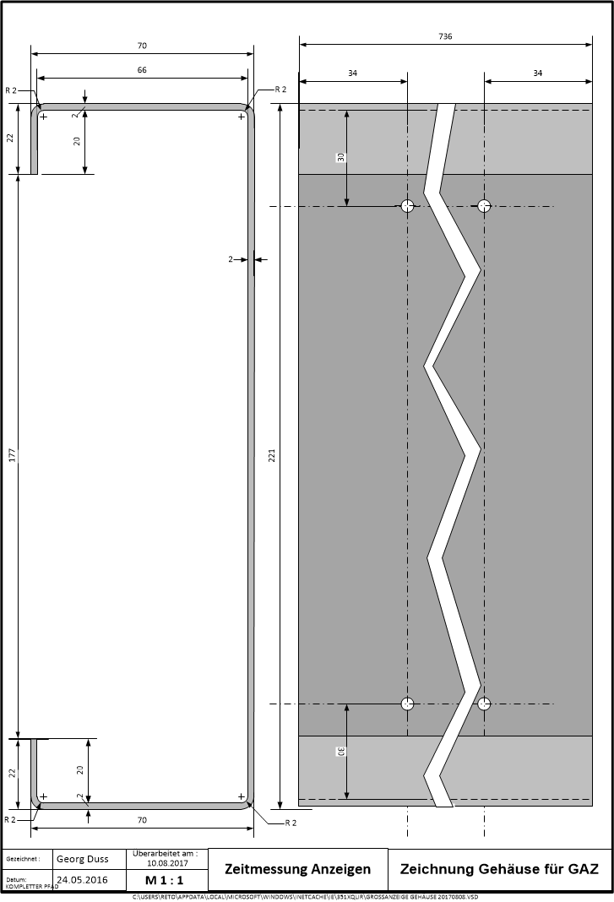

Zusammengesetzt sieht das ganze dann wie folgt aus:

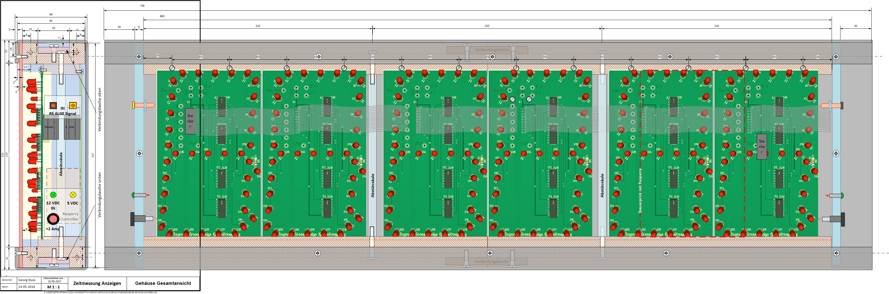
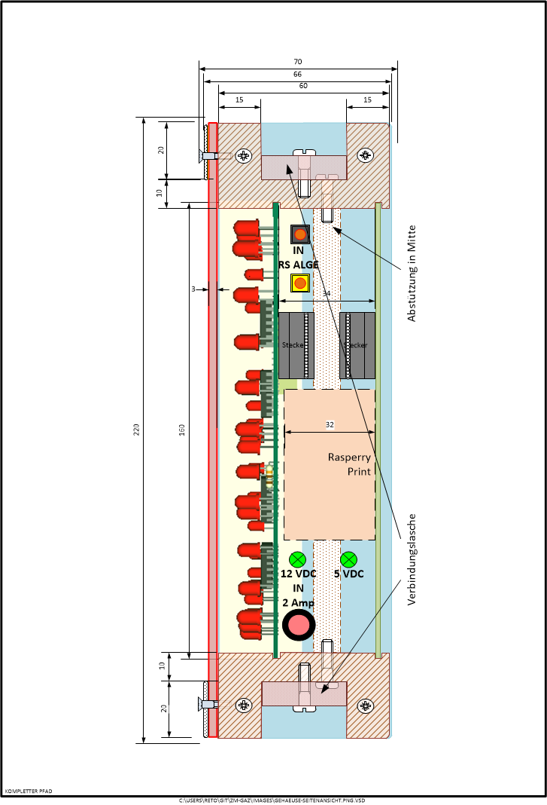

## Software

Die Software besteht aus einen Java Program, welches die [pi4j](http://pi4j.com/) Bibliothek verwendet um das RS 232 Signal zu lesen und die SPI Schnittstelle zum 7-Segment Steuer-Baustein anzusteuern.

## Erbauer

Die GAZ wurde vom Zeitmessteam des Turnverein Küssnacht (Georg Duss, Reto Weiss) erstellt. 

